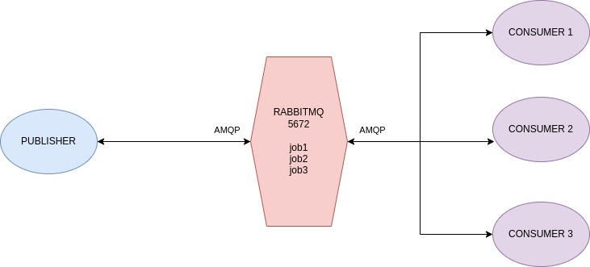

# Rabbit
    A project for learning RabbitMQ, queues and message queues.
    Developed in Erlang.
    Distributed Message Queue.
    docker run -d -p 5672:5672 rabbitmq (TCP)

## When to use it
    In a Node.js TCP system, asyncronous, when you overwhelm the single server (single thread) to execute all your requests.

    A lot of time or processing spent in a request (bad user experience).

    You can also use a Load Balancer to divide the requests between containers and instances (AWS). But if is not the number of request, but the lenght of request, it will not work.

    In this cases, employ a message queue :).

## How does it works
1. Send the big request
2. Rapidly respond the user
3. Put the request in a queue
4. Execute the messages

